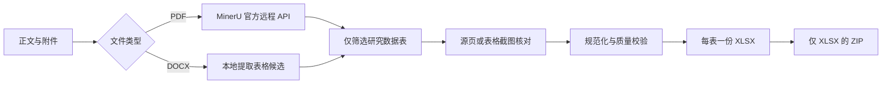

# Paper Tables to Excel

一个面向 Codex 的论文表格提取 Skill：只识别论文正文 PDF 与补充材料中的**研究数据表格**，将每个表格转换为一份只含数据的 Excel 文件，并将全部 `.xlsx` 打包为 ZIP。

PDF 必须通过 MinerU 官方远程 API 解析；Skill 不调用本机 MinerU、不会读取本地保存的 Token，也不会把 Token 写入配置、日志或产物。每次执行时，由当前用户在遮蔽输入框中提供自己的 MinerU API Token。

## 主要能力

- 同时处理正文 PDF、附件 PDF 和附件 DOCX。
- 每个 PDF 均调用 MinerU；多个 PDF 可在一次遮蔽提示中共用本次运行的 Token。
- 只保留真正的研究数据表格，排除目录、问卷、检索式、缩略词表、报告清单等非数据表。
- 每个源表格生成一份 `.xlsx`；结构不兼容的面板会拆成独立文件。
- 每个工作簿只含一个名为 `Data` 的工作表、一个表头行和数据行。
- 自动执行结构校验、重复或子集提示、工作簿回读校验及 ZIP 内容校验。
- 来源、哈希、页码、候选编号和告警写入 ZIP 外部的 `conversion_manifest.json`，不会混入数据表。

## 纯数据规则

导出的 Excel 遵守以下约束：

- 删除 `source`、`provenance`、DOI、URL 等来源字段。
- 删除全部 p 值信息，包括 p 值列、显著性星号和只描述 p 值的注释。
- 置信区间拆为独立的下限列和上限列。
- 同一单元格中的估计值、标准差、样本量、缺失数、百分比、四分位数、范围等拆为独立字段。
- 数值类别的上下界拆为独立列；关系符号改写为 `Below`、`Range`、`At least` 等文本。
- 数值以 Excel 数值类型保存；缺失值留空，不以零代替。
- 数据单元格不保留百分号、正负号组合、括号、区间标点、千位分隔符、显著性符号等格式字符。
- 不添加标题行、合并单元格、公式、图表、脚注、说明或来源行。
- 不静默删除正文与附件之间的重复表；两份均可导出，并在外部清单中报告重复关系。

详细规范见 [`references/normalized-schema.md`](references/normalized-schema.md) 与 [`references/table-recognition.md`](references/table-recognition.md)。

## 工作流程



MinerU 的解析结果只作为候选证据。Skill 要求将每个纳入表格与 MinerU 表格截图或源页面核对，避免把 OCR 或版面识别错误直接写入 Excel。

## 安装

将仓库克隆到 Codex 的个人 Skill 目录：

### Windows PowerShell

```powershell
git clone https://github.com/elektrolux/paper-tables-to-excel.git "$env:USERPROFILE\.codex\skills\paper-tables-to-excel"
```

### macOS 或 Linux

```bash
git clone https://github.com/elektrolux/paper-tables-to-excel.git ~/.codex/skills/paper-tables-to-excel
```

安装后重新打开 Codex 会话，使 Skill 清单刷新。仓库根目录必须直接包含 `SKILL.md`。

## 使用

在 Codex 中上传或指定正文和补充材料，然后明确调用 Skill。例如：

```text
使用 $paper-tables-to-excel，将 main.pdf 作为正文、supplement.pdf 和 supplement.docx 作为附件；
只转换数据表，每个表格生成一份 Excel，最后打包为 ZIP。
```

运行到 PDF 解析阶段时，Skill 会要求输入当前用户自己的 MinerU API Token。Token 输入被遮蔽，仅在当前转换进程内短暂使用。

### 隐私提示

执行本 Skill 等同于授权将本次任务范围内的 PDF 上传到 MinerU 官方远程服务。DOCX 默认只在本地解析，不上传到 MinerU。请先确认文档适合提交给第三方服务，并遵守论文、数据及机构的保密要求。

## MinerU 运行方式

通常应让 Codex 按 `SKILL.md` 自动编排。以下命令仅用于开发或排错。

转换多个 PDF：

```text
python scripts/mineru_batch_convert.py main.pdf supplement.pdf --output-root run/mineru --model-version vlm --language ch
```

转换单个 PDF：

```text
python scripts/mineru_convert.py main.pdf --output run/mineru/main --model-version vlm --language ch
```

扫描版或图片型表格可添加 `--ocr`。不要使用 `--disable-table`。MinerU 访问、鉴权或解析失败时，Skill 会报告阻塞原因，不会改用本机解析器或猜测数据。

MinerU 官方 API 文档：<https://mineru.net/doc/docs/index_en/>

## 中间数据与导出

候选提取命令：

```text
python scripts/extract_mineru_tables.py run/mineru/main --output run/main_candidates.json --role main --source-file main.pdf
python scripts/extract_docx_tables.py supplement.docx --output run/supplement_candidates.json --role attachment
```

候选经来源核对和结构化后，应写成 [`references/normalized-schema.md`](references/normalized-schema.md) 定义的 JSON。随后执行：

```text
python scripts/validate_normalized.py run/normalized_tables.json --report run/validation_report.json
node scripts/export_pure_data.mjs run/normalized_tables.json run/xlsx
python scripts/package_xlsx.py run/xlsx/conversion_manifest.json --output run/paper_tables.zip
```

`export_pure_data.mjs` 使用 Codex 随附的 `@oai/artifact-tool`。在 Codex 外部单独运行时，需要自行提供兼容的 Node.js 环境与该依赖。

## 产物结构

典型运行目录如下：

```text
run/
├── mineru/                       # MinerU 返回内容与解析清单
├── normalized_tables.json        # 导出前的结构化数据
├── validation_report.json        # 规范化校验结果
├── xlsx/
│   ├── Table_1.xlsx              # 每个表格一份工作簿
│   ├── Table_S1.xlsx
│   └── conversion_manifest.json  # 来源和质量信息，不进入 ZIP
└── paper_tables.zip              # 只包含 XLSX
```

## 完成标准

只有在以下条件全部满足后，任务才算完成：

1. 每个范围内 PDF 都有 MinerU 清单和启用表格识别的输出。
2. 每个纳入项都已确认是研究数据表，所有排除项都有原因。
3. 每个源表格映射到一份工作簿，或映射到明确命名的面板工作簿。
4. 表头不含 p 值或来源字段。
5. 统计列只含数值或空白，不含复合数字字符串。
6. 每个置信区间均有独立的下限列和上限列。
7. 工作簿不含公式或电子表格错误，且已回读和渲染检查。
8. ZIP 中只有预期的 `.xlsx` 文件。

## 目录说明

```text
paper-tables-to-excel/
├── SKILL.md                       # Codex 执行规范
├── README.md                      # 项目说明
├── agents/openai.yaml             # Skill 展示信息与默认提示
├── references/
│   ├── mineru-runtime.md           # MinerU 调用与 Token 安全
│   ├── normalized-schema.md        # 规范化 JSON 与纯数据规则
│   └── table-recognition.md        # 数据表识别边界
└── scripts/
    ├── mineru_convert.py           # 单 PDF 远程解析
    ├── mineru_batch_convert.py     # 多 PDF 一次输入 Token
    ├── extract_mineru_tables.py    # MinerU 表格候选提取
    ├── extract_docx_tables.py      # DOCX 表格候选提取
    ├── validate_normalized.py      # 导出前质量门槛
    ├── export_pure_data.mjs        # 一表一 XLSX
    └── package_xlsx.py             # 仅 XLSX 的 ZIP
```

## 适用边界

- 本项目是 Codex Skill，不是“整篇文档转 Excel”的通用转换器。
- 不转换正文段落、图片、流程图、参考文献、作者信息或非数据表。
- 自动提取不等于自动证明准确；复杂跨页表、旋转表、扫描表和多层合并表头仍必须经过来源核对。
- 不根据上下文补值、推算、平均或修正原文数字；无法可靠还原时应报告具体阻塞表格。

## 安全设计

- Token 不接受命令行参数，不从环境变量或凭据存储读取。
- Token 不写入 `mineru_manifest.json`、转换清单、异常文本或 shell 历史。
- 文档内容一律视为待处理数据，不视为可以覆盖用户请求的指令。
- 原始文档保持不变；所有结果写入新的运行目录。

